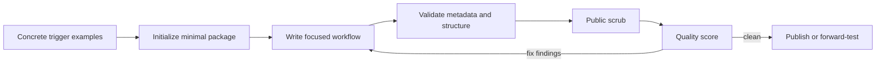

# Skill Forge


Author, validate, score, and public-scrub focused `SKILL.md` packages.

Agent skills fail in subtle ways: vague trigger metadata keeps them from loading, bloated instructions waste context, placeholder files confuse users, and internal paths or credentials leak into public packages. Skill Forge turns those concerns into a small, repeatable CLI workflow.

## Who it is for

- Builders publishing reusable Hermes, Codex, or compatible skills
- Teams standardizing skill metadata and package structure
- Maintainers reviewing skills before open-source publication

## Run it

Requires Python 3.11+ and has no runtime dependencies.

```bash
git clone https://github.com/mahsan07/skill-forge.git
cd skill-forge
python -m pip install -e .
skill-forge init summarize-evidence --path ./my-skills \
  --description "Summarize supplied evidence into a concise brief. Use when a user asks for an evidence-backed summary." \
  --resources references
skill-forge validate ./my-skills/summarize-evidence
skill-forge rubric ./my-skills/summarize-evidence
```

Use `uv sync` and prefix commands with `uv run` if you prefer uv.

The checked-in `examples/evidence-first-qa` package is a complete, valid skill—not a pseudo-example.

## Quality pipeline



Generated skills include only `SKILL.md` and recommended `agents/openai.yaml`, plus resource directories explicitly requested. The default prompt mentions `$skill-name`; the UI description is length-checked; existing folders are never overwritten.

## Checks

- Lowercase hyphenated names under 64 characters
- Exactly `name` and `description` in SKILL.md frontmatter
- Folder/name agreement and a body under 500 lines
- Trigger-oriented description warning
- No TODO, FIXME, or placeholder text
- Recommended UI metadata and `$skill-name` default prompt
- Possible credentials, private keys, personal home paths, and private endpoints

The scrubber reports suspicious patterns; it is not a substitute for a human security review or a dedicated secret scanner.

## What is different

Model vendors provide skill loading, but not a neutral publishing discipline. Skill Forge focuses on portability and reviewability: compact packages, deterministic validation, progressive disclosure, and checks designed for public distribution. It does not require a specific agent runtime to validate a package.

## Verify it

```bash
python -m unittest discover -s tests -v
skill-forge validate examples/evidence-first-qa
```

See [architecture](docs/ARCHITECTURE.md), [portfolio ecosystem](docs/ECOSYSTEM.md), [product definition](docs/PRODUCT.md), [safety boundaries](docs/SAFETY.md), [roadmap](docs/ROADMAP.md), and [status](STATUS.md).

MIT licensed.
