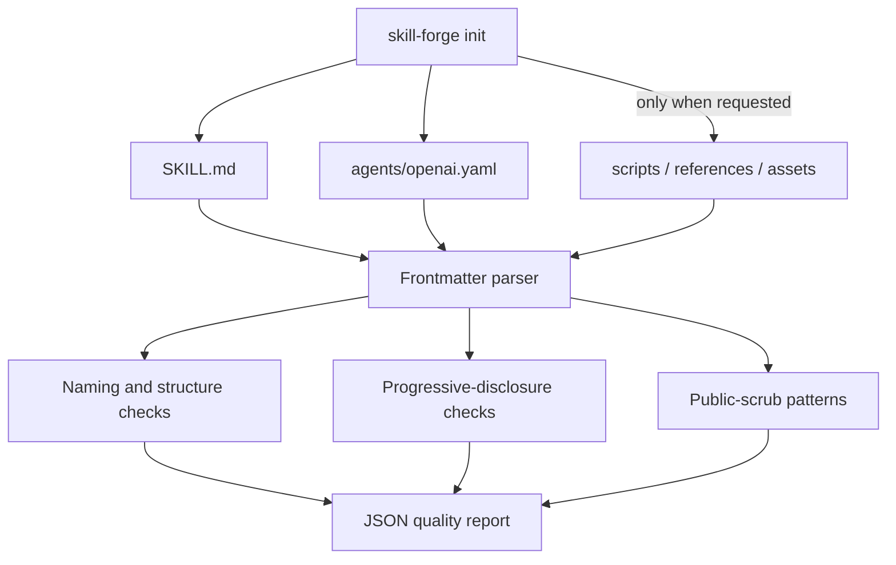

# Architecture



## Design rules

- The generator refuses to overwrite an existing skill directory.
- Generated SKILL.md frontmatter contains only `name` and `description`.
- UI metadata is separate in `agents/openai.yaml` and quotes all strings.
- Optional resource directories exist only when requested.
- Validation returns machine-readable JSON and a process exit code.

The frontmatter parser intentionally supports the compact flat metadata used by portable skills; it is not a general YAML parser. Public-scrub patterns are explainable heuristics and may produce false positives or miss encoded secrets.

## Progressive disclosure

```text
metadata (always visible)
  -> SKILL.md workflow (loaded when triggered)
      -> scripts/references/assets (loaded or executed only as needed)
```
