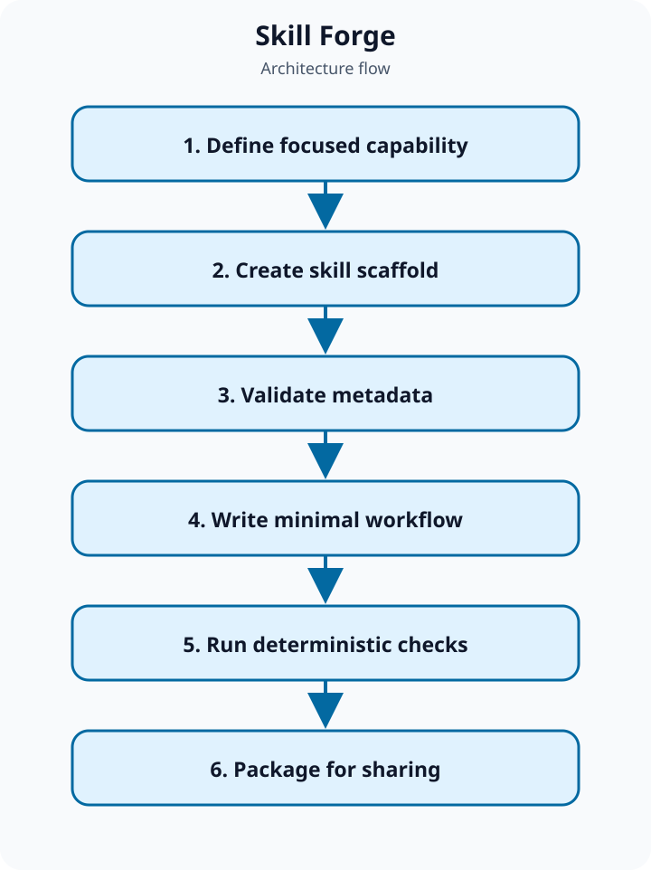
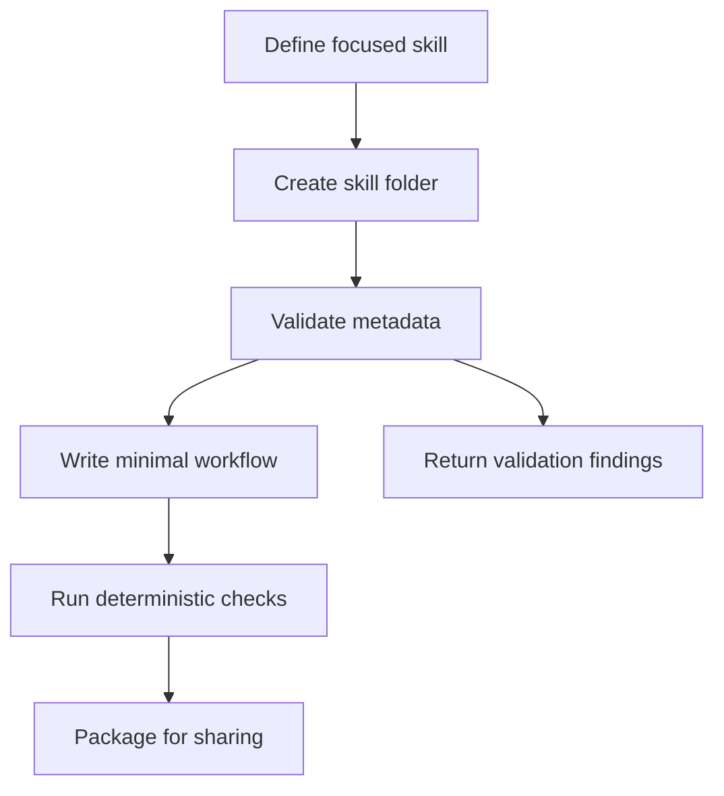
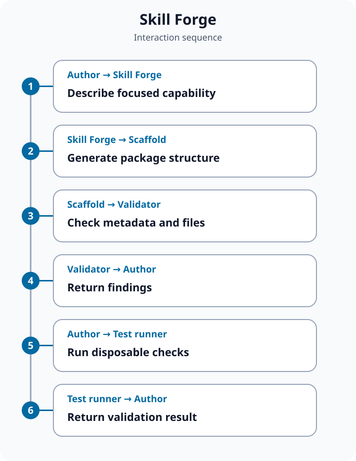
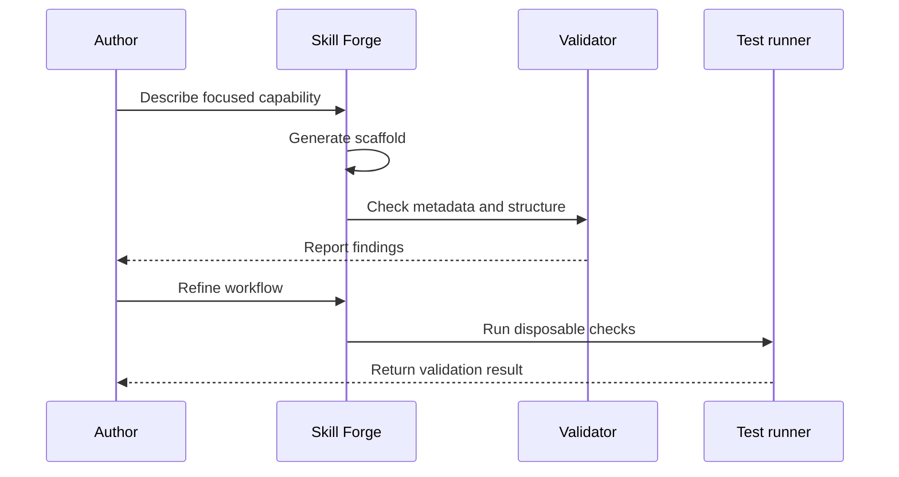

# Skill Forge diagrams

## Skill packaging flow

### Mermaid source

```mermaid
flowchart TD
  Author["Define focused skill"] --> Scaffold["Create skill folder"]
  Scaffold --> Metadata["Validate metadata"]
  Metadata --> Workflow["Write minimal workflow"]
  Workflow --> Test["Run deterministic checks"]
  Test --> Release["Package for sharing"]
  Metadata --> Fix["Return validation findings"]
```

## Authoring sequence

### Mermaid source

```mermaid
sequenceDiagram
  participant A as Author
  participant F as Skill Forge
  participant V as Validator
  participant T as Test runner
  A->>F: Describe focused capability
  F->>F: Generate scaffold
  F->>V: Check metadata and structure
  V-->>A: Report findings
  A->>F: Refine workflow
  F->>T: Run disposable checks
  T-->>A: Return validation result
```
