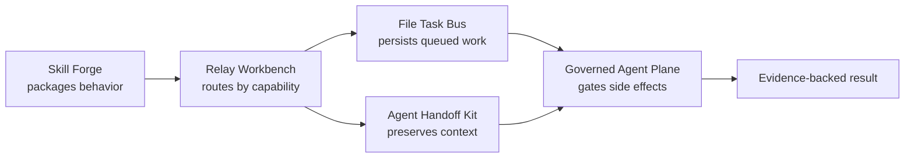

# Portfolio Ecosystem

These five repositories are intentionally separate, reusable layers. Users can adopt one without installing the others.

| Repository | Independent responsibility |
| --- | --- |
| [file-task-bus](https://github.com/mahsan07/file-task-bus) | Durable local task transport and lifecycle lanes |
| [governed-agent-plane](https://github.com/mahsan07/governed-agent-plane) | Preview, approval, constrained execution, and audit |
| [agent-handoff-kit](https://github.com/mahsan07/agent-handoff-kit) | Portable context and ownership transfer protocol |
| [skill-forge](https://github.com/mahsan07/skill-forge) | Reusable skill authoring and publication quality |
| [relay-agent-workbench](https://github.com/mahsan07/relay-agent-workbench) | Capability-based routing across heterogeneous agents |

## How they compose

The repositories do not depend on each other at runtime in their MVP form. That keeps installation, review, and reuse simple. Their JSON records are deliberately straightforward so adapters can compose them later without forcing a monorepo or one vendor SDK.
